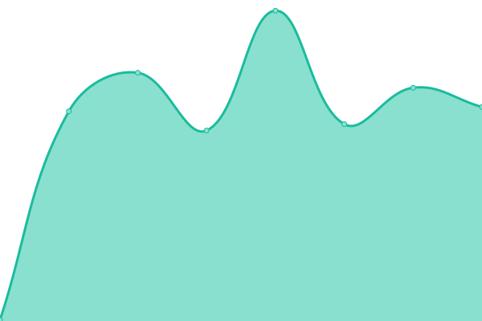
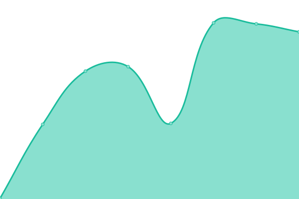
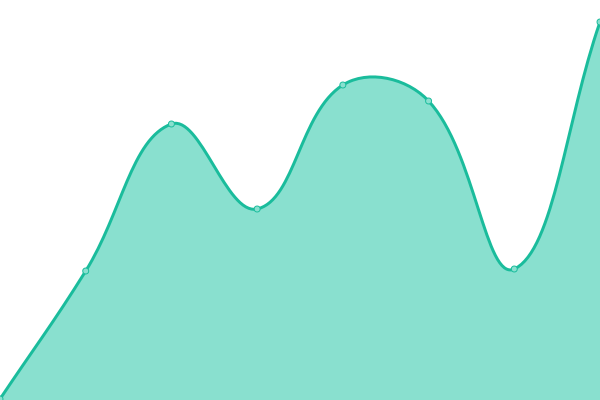

# [📈 Live Status](https://status.sage-iq.com): <!--live status--> **🟩 All systems operational**

This repository contains the open-source uptime monitor and status page for [Sage IQ](http://sage-iq.com/), powered by [Upptime](https://github.com/upptime/upptime).

With [Upptime](https://upptime.js.org), you can get your own unlimited and free uptime monitor and status page, powered entirely by a GitHub repository. We use [Issues](https://github.com/sage-iq/upptime/issues) as incident reports, [Actions](https://github.com/sage-iq/upptime/actions) as uptime monitors, and [Pages](https://status.sage-iq.com) for the status page.

<!--start: status pages-->
<!-- This summary is generated by Upptime (https://github.com/upptime/upptime) -->
<!-- Do not edit this manually, your changes will be overwritten -->
<!-- prettier-ignore -->
| URL | Status | History | Response Time | Uptime |
| --- | ------ | ------- | ------------- | ------ |
|  [Sage IQ](https://sage-iq.com/) | 🟩 Up | [sage-iq.yml](https://github.com/sage-iq/upptime/commits/HEAD/history/sage-iq.yml) | 

 162ms
     
 | 

<a href="https://status.sage-iq.com/history/sage-iq">100.00%</a>
    

|  tcg | 🟩 Up | [tcg.yml](https://github.com/sage-iq/upptime/commits/HEAD/history/tcg.yml) | 

 252ms
     
 | 

<a href="https://status.sage-iq.com/history/tcg">100.00%</a>
    

|  [Labs](https://labs.sage-iq.com/) | 🟩 Up | [labs.yml](https://github.com/sage-iq/upptime/commits/HEAD/history/labs.yml) | 

 192ms
     
 | 

<a href="https://status.sage-iq.com/history/labs">100.00%</a>
    

<!--end: status pages-->

[**Visit our status website →**](https://status.sage-iq.com)

## 📄 License

- Powered by: [Upptime](https://github.com/upptime/upptime)
- Code: [MIT](./LICENSE) © [Sage IQ](http://sage-iq.com/)
- Data in the `./history` directory: [Open Database License](https://opendatacommons.org/licenses/odbl/1-0/)
